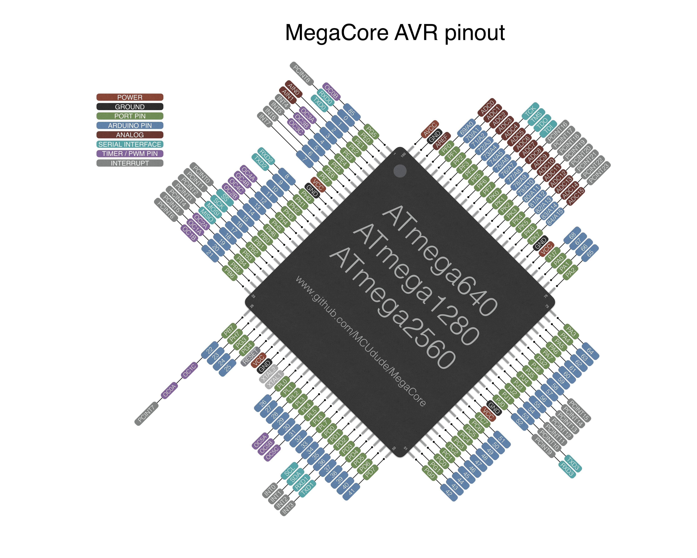

# You should use code only when you understand them  
  
### This repository is a collection of libraries of different modules  
  
**Written exclusively for Arduino Nano, Uno, Mega, Mega2560, Mega2560 pro**  
  
You may download the whole repository as a zip to your local drive, and then open your Arduino IDE.  
Select from the IDE's toolbar: Sketch -> Include Library -> Add .ZIP library... -> and select the folder containing a desired module, maybe like Us_016  

Then you can use the library of the desired module.  
You may like to see the examples of the modules to get a better understanding on how to use them.  
To do so, select from the IDE's toolbar: File -> Examples -> (Scroll to the bottom) and hover the library name of the module you have added to Arduino IDE just now, then you can take a look or even try uploading the examples to your Arduino board.  

### Please do not use any undocumented libraries (i.e. libraries **without README.md files** or versions of libraries with **non-updated README.md files**). These libraries are mainly under testing stage, and are not proved to be 100% working.  

If you find any problems, please raise an issue or contact me at yhei.choi@gmail.com.  
  
**This repository is written and maintained by YH Choi,**  
**tested with hardware modules provided by CSWCSS REC**  
**and technically supported by CSWCSS REC hardware team.**  
  
[ATmega640 | ATmega1280 | ATmega2560 datasheet](https://ww1.microchip.com/downloads/en/devicedoc/atmel-2549-8-bit-avr-microcontroller-atmega640-1280-1281-2560-2561_datasheet.pdf)  
  
[AVR Instruction Set Manual](http://ww1.microchip.com/downloads/en/devicedoc/atmel-0856-avr-instruction-set-manual.pdf)  
  

